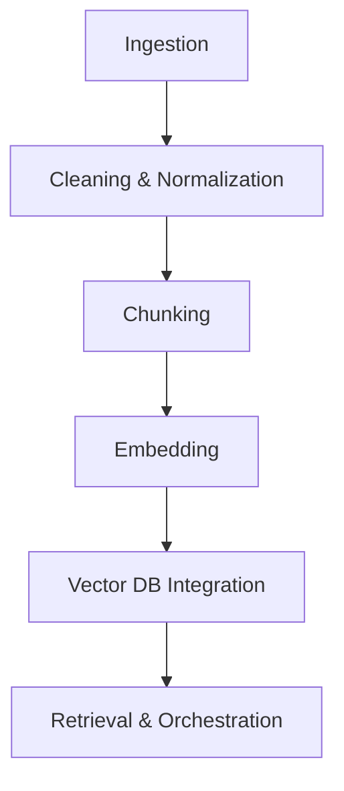

[⬅ Back](../index.md)

# 🛠️ Data Pipeline & Processing

> **Purpose:**
> Build efficient, scalable, and auditable pipelines for transforming raw data into AI-ready features for RAG, code search, and generative AI use cases.

---

## Overview

This document details the modular, testable data pipeline powering CodeCraft AI’s AI code assistant. The pipeline supports ingestion, cleaning, chunking, embedding, and vector database integration for scalable, context-aware code retrieval and generation.

---

## Pipeline Flow


1. **Ingestion:**
   Automated scripts fetch raw data from approved sources (docs, repos, etc.).
2. **Cleaning & Normalization:**
   Removes duplicates, filters sensitive data, and standardizes format.
3. **Chunking:**
   Splits code/text into semantically meaningful chunks, with language/framework awareness.
4. **Embedding:**
   Converts chunks into vector representations using a production embedding model.
5. **Vector DB Integration:**
   Stores embeddings for fast similarity search and retrieval.
6. **Retrieval & Orchestration:**
   (Optional) Retrieves relevant chunks for LLM context.

---

## Modularity & Extensibility

- Each stage is a standalone, testable module/class.
- Add new sources, chunkers, embedders, or DBs by extending the respective module.
- Language/framework-specific chunking is handled via a strategy pattern in [`langchain_chunking_strategy.py`].
- **Dev vs. Prod:**
  - Dev: Use local files, in-memory vector DB, and verbose logging.
  - Prod: Use cloud storage, scalable vector DB (e.g., Pinecone, FAISS), and info/error logging.

---

## Testing & Observability

- Unit and integration tests for each stage (see `core/data_pipeline/tests/`).
- Centralized, configurable logging at every step (dev: DEBUG, prod: INFO/WARNING).
- Metrics and error handling for robust monitoring.
- **Dev vs. Prod:**
  - Dev: Enable detailed logs, test with sample data, run all tests locally.
  - Prod: Log only essential info/errors, monitor metrics, run CI/CD tests.

---

## Configuration

- All settings (paths, models, chunk sizes, logging, etc.) are managed via `config.yaml`.
- Language/framework for chunking can be set per file, inferred automatically, or overridden in config.
- **Dev vs. Prod:**
  - Dev: Use sample/test data, local paths, and debug log level.
  - Prod: Use full datasets, cloud/object storage, and info log level.

---

## Best Practices & Gotchas

- Privacy and compliance checks are integrated at every stage.
- Bias and hallucination monitoring are ongoing.
- Atomic writes and error handling prevent data loss.
- Always validate data and log anomalies.
- For large files, chunk and process incrementally to avoid memory issues.

---

## Embedding Models vs. Foundational Models

- **Embedding Model:**
  Used to convert code/text chunks into vector representations (“embeddings”) for similarity search and retrieval.
  Example: `sentence-transformers/all-MiniLM-L6-v2`, OpenAI `text-embedding-ada-002`, or code-specific models.
  - **Technical note:** Embedding models use only the encoder part of a neural network architecture.

- **Foundational Model (LLM):**
  Used to generate code, answers, or explanations based on user prompts and retrieved context.
  Example: GPT-4, Llama, StarCoder, etc.
  - **Technical note:** LLMs use a decoder (or encoder-decoder) architecture for text/code generation.

**Relationship in the Pipeline:**
1. The embedding model encodes all source data into vectors for fast retrieval.
2. At inference time, the user’s query is embedded, similar chunks are retrieved, and these are passed as context to the foundational model for generation.

> _“Embeddings come from encoders. Generation comes from decoders. RAG pipelines use both, each for what they do best.”_

---

## Example Usage

```python
from chunker import CodeChunker
from embedder import CodeEmbedder
from vectordb import VectorDB

chunker = CodeChunker()
chunks = chunker.chunk_text(code_string, language="python")
embeddings = CodeEmbedder().embed_chunks(chunks)
VectorDB().upsert(chunks, embeddings)
```

---


> _“A modular, testable pipeline is the engine of reliable AI. Invest in clean interfaces, robust tests, and scalable storage from day one.”_
