[⬅ Back](../index.md)

# ⚙️ Dev Environment & Data

> **Purpose:**
> Establish a production-ready development environment and source high-quality, governed data for the AI solution.

---

# 🛠️ Development Environment

## Goals

- Ensure every contributor can spin up an identical environment quickly.
- Support local development, testing, and CI/CD.
- Enable reproducibility and easy onboarding.

---

## Components

- **Containerization:**
  - Use Docker for all core services (API, retrieval, LLM interface, database).
  - Provide a `docker-compose.yml` for local orchestration.
- **Version Control:**
  - All code, configs, and infra-as-code tracked in Git.
  - Use `.gitignore` to exclude secrets and local artifacts.
- **CI/CD Hooks:**
  - Pre-commit hooks for linting and formatting.
  - GitHub Actions (or similar) for automated testing and builds.
- **Data Management:**
  - Use bind mounts/volumes for persistent data in local dev.
  - Provide sample/test data for development and CI.
- **Secrets Management:**
  - Use environment variables and `.env.example` for sensitive configs.

---

## Quickstart

1. **Clone the repository:**

   ```sh
   git clone https://github.com/Dee66/contract-buddy.git
   cd corecraft-ai
   ```

2. **Copy environment variables template:**

   ```sh
   cp .env.example .env
   ```

3. **Start the stack:**

   ```sh
   docker-compose up --build
   ```

4. **Run tests:**
   ```sh
   docker-compose exec api pytest
   ```

---

## Professional Insight

> “A reproducible, containerized dev environment is the foundation of modern AI deliveryenabling rapid onboarding, reliable CI/CD, and seamless collaboration.”

---

# 📦 Data Sourcing & Governance

## Overview

Establish robust processes for ingesting, cleaning, normalizing, and versioning all data used in CodeCraft AI, with a focus on privacy and compliance.

---

## Data Ingestion

- **Automated Pipelines:**
  Scripts and/or services fetch data from approved sources (official docs, open-source repos, etc.).
- **Scheduling:**
  Regular updates scheduled (e.g., nightly/weekly) to keep the RAG index current.
- **Logging:**
  All ingestion events are logged for traceability.

---

## Data Cleaning & Normalization

- **Cleaning:**
  - Remove duplicates, irrelevant, or low-quality code/data.
  - Strip sensitive or proprietary information.
- **Normalization:**
  - Standardize code formatting and metadata.
  - Tag data with language, framework, and license info.

---

## Privacy & Compliance

- **Data Minimization:**
  Only ingest data necessary for code generation.
- **Anonymization:**
  Remove or mask any personal or sensitive information.
- **Audit Trails:**
  Maintain logs of data source, ingestion date, and processing steps.
- **License Tracking:**
  Track and enforce licensing for all ingested data.

---

## Data Versioning

- **Version Control:**
  Store processed datasets and indexes with version tags (e.g., in DVC, Git LFS, or object storage).
- **Reproducibility:**
  Document dataset versions used for each model or RAG deployment.

---

> **Sage Wisdom:**
> “Strong data governance is the foundation of trustworthy, scalable AI. Every byte ingested should be traceable, compliant, and ready for audit.”

---

## Data Sourcing (Overview)

- **Foundational Model:**
  The core LLM will be sourced from reputable providers (e.g., OpenAI, Anthropic, or open-source alternatives).
- **Supplemental Data for RAG:**
  - Plan to ingest and index high-quality, legally-permissible sources such as official documentation, curated GitHub repos, and (if licensing allows) Stack Overflow Q&A.
  - All external data sources will be vetted for licensing and compliance.
- **Local Development:**
  - Provide scripts or Docker services to fetch, preprocess, and index sample datasets for RAG.
  - Reference detailed data sourcing and compliance guidelines in [`Data_Sourcing.md`](Data_Sourcing.md).

---

> **Note:**
> Data sourcing and ingestion pipelines are modular and can be toggled or extended as new sources become available or as legal review permits.

```mermaid
graph TD
    env["<b>🛠️ Dev Environment</b>"]
    data["<b>📰 Data Sourcing & Governance</b>"]
    env --> data
```



---

> **Professional Insight:**
> A disciplined environment and clean data are the foundation of reliable AI, no matter the domain.

---

## 🧩 Sample docker-compose.yml

A sample `docker-compose.yml` is provided to orchestrate all core services for local development and testing:

```yaml
version: "3.8"
services:
  api:
    build: ./api
    ports:
      - "8000:8000"
    env_file:
      - .env
    volumes:
      - ./api:/app
  db:
    image: postgres:15
    environment:
      POSTGRES_PASSWORD: example
    volumes:
      - db_data:/var/lib/postgresql/data
volumes:
  db_data:
```

---

## 💻 Dev Container Support

For seamless onboarding, a `.devcontainer` folder is provided.
Open the project in VS Code and select **“Reopen in Container”** to get started instantly with a pre-configured environment.

---

## 🔑 Environment Variables

A `.env.example` file is included as a template for environment variables and secrets.
Copy it to `.env` and fill in any required values before starting the stack.

---

## ⚡ GPU Support

For large model inference, ensure Docker host or cloud instance has GPU support enabled.

- Use the `--gpus all` flag with Docker Compose for local GPU acceleration.
- Select GPU-enabled runners for CI/CD and cloud deployments where applicable.

---

# 🔒 Ongoing Privacy & Compliance

## Purpose

Ensure continuous, proactive review of all data handling, privacy, and compliance practices throughout the AI solution lifecycle.

---

## Continuous Review Practices

- **Regular Audits:**
  Schedule quarterly reviews of all data sources, ingestion scripts, and storage to ensure compliance with internal policies and external regulations (e.g., GDPR, CCPA).
- **Data Provenance Tracking:**
  Maintain detailed logs of data origin, licensing, and processing steps for every dataset version.
- **Access Controls:**
  Enforce strict RBAC (Role-Based Access Control) for all sensitive data and logs.
- **Incident Response:**
  Document and rehearse procedures for responding to privacy or compliance incidents, including notification and remediation steps.
- **User Consent & Rights:**
  Ensure mechanisms exist for users to request data deletion or review, and honor opt-out requests.
- **Automated Monitoring:**
  Use automated tools to scan for PII, secrets, or policy violations in both raw and processed data.
- **Policy Updates:**
  Stay informed of regulatory changes and update documentation, processes, and training accordingly.

---

## Documentation & Reporting

- **Audit Logs:**
  Store audit logs securely and review them regularly.
- **Compliance Reports:**
  Generate and archive compliance reports after each audit or major release.
- **Training:**
  Provide ongoing privacy and compliance training for all contributors.

---

## Automation & Code Hooks for Compliance

- **Automated PII/Secret Scanning:**
  Integrate scripts (e.g., in the data pipeline) that scan all ingested and processed data for personally identifiable information (PII), secrets, or credentials using regex and ML-based detectors.
  - Example: Extend `SensitiveDataFilter` to flag and report PII patterns (emails, phone numbers, etc.).
- **Pre-Commit & CI/CD Hooks:**
  Add pre-commit hooks and CI/CD pipeline steps to automatically check for sensitive data, license violations, or policy breaches before code or data is merged or deployed.
  - Tools: [pre-commit](https://pre-commit.com/), [detect-secrets](https://github.com/Yelp/detect-secrets), [git-secrets](https://github.com/awslabs/git-secrets)
- **Automated Audit Log Review:**
  Schedule scripts to periodically review audit logs for unauthorized access or anomalies, and alert maintainers if issues are detected.
- **Compliance Test Suite:**
  Develop automated tests that validate data handling against compliance requirements (e.g., ensuring all data is anonymized, opt-out requests are honored, and logs are retained/deleted per policy).
- **Continuous Monitoring:**
  Integrate with monitoring tools to track data access patterns and flag unusual or non-compliant activity in real time.

---

## Example: Compliance Check Script (Python)

```python
# compliance_check.py
import re

PII_PATTERNS = [
    r"\b\d{3}-\d{2}-\d{4}\b",  # SSN
    r"\b\d{10}\b",             # Phone number
    r"[a-zA-Z0-9_.+-]+@[a-zA-Z0-9-]+\.[a-zA-Z0-9-.]+",  # Email
]

def scan_for_pii(text):
    for pattern in PII_PATTERNS:
        if re.search(pattern, text):
            return True
    return False

# Usage: integrate into data pipeline or as a pre-commit/CI check
```

---

> **Professional Insight:**
> “Automated compliance checks are the first line of defense. Integrate them early and run them often to ensure the AI solution remains trustworthy and audit-ready.”

---

## Addressing Bias & Hallucinations

- **Bias Monitoring:**
  Regularly audit model outputs for biased, discriminatory, or non-inclusive code suggestions. Use automated tests and human review to flag and correct problematic patterns.
- **Hallucination Detection:**
  Implement checks to identify and flag hallucinated (factually incorrect or fabricated) code or documentation. Provide clear warnings to users when confidence is low or when outputs are not directly sourced from trusted data.
- **User Feedback Loops:**
  Enable users to report biased or incorrect outputs, and use this feedback to retrain models and improve retrieval sources.
- **Transparency:**
  Document known limitations and risks related to bias and hallucination in user-facing materials and compliance reports.

---

> **Ethical Insight:**
> “Responsible AI means not only protecting privacy, but also actively reducing bias and hallucination. Continuous vigilance in these areas is essential for trust and compliance.”

---

For details on the data pipeline structure and usage, see [core/data_pipeline/README.md](../../core/data_pipeline/README.md).
