```mermaid
graph TD
    load["<b>🏗️ Model Loading</b>"]
    peft["<b>🔧 PEFT/Fine-tuning</b>"]
    infer["<b>🤖 Inference Logic</b>"]
    exp["<b>🧪 Experiments & Logging</b>"]
    load --> peft
    peft --> infer
    infer --> exp
```

[⬅ Back](../index.md)

# 🤖 Model Implementation & Experimentation

> **Purpose:**
> Implement, experiment, and iterate on the AI model with scientific rigor, regardless of the domain.

---

## 🏗️ Model Implementation

- Load and configure base models.
- Apply PEFT (LoRA/QLoRA) or other fine-tuning methods if needed.
- Implement inference logic (RAG, classification, regression, etc.).

---

## 🧪 Controlled Experimentation

- Design and run controlled experiments.
- Log results, resource usage, and insights.

---

## 🔄 Model Versioning, Rollback & Deprecation

- All models are versioned and tracked in a model registry.
- Rollback procedures are documented for rapid recovery.
- Deprecation plans ensure outdated models are retired safely and transparently.

---

---

> **Professional Insight:**
> Experimentation and measurement are the heart of trustworthy AIapply these principles to any model or use case.
