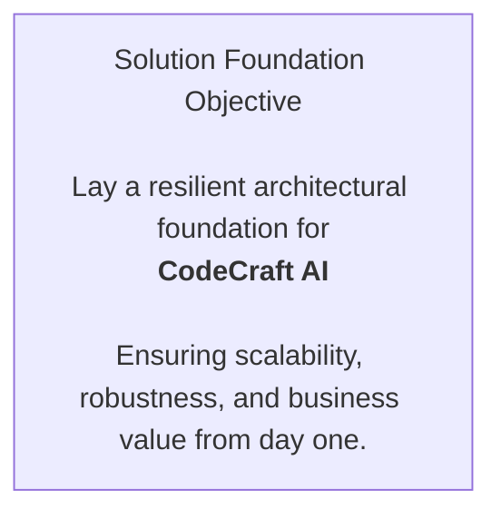

[⬅ Back](../index.md)

[⬅ Back to Checklist](../checklist.md)

# 🎯 Objective

> **Establish a robust architectural foundation for CodeCraft AIan AI-powered coding assistantensuring scalability, reliability, and measurable business value from day one.**

---

**Objective Statement:**
Lay the groundwork for a production-grade AI solution that accelerates software development by delivering context-aware, high-quality code suggestions and scaffolding.
This foundation will support future enhancements, seamless integration, and operational excellence.

---

---

**Key Outcomes:**
- Clear alignment with real developer needs and business goals.
- Modular, secure, and extensible architecture.
- Documented rationale for all major design decisions.

---

> **Professional Insight:**
> A well-defined objective is the compass for every architectural decision.
> For CodeCraft AI, this means building not just for today’s requirements, but for tomorrow’s opportunities and challenges.

> **Elevator Pitch:**
> *CodeCraft AI is an AI-powered coding assistant that delivers context-aware, production-ready code and deployment assetsaccelerating developer productivity and enabling rapid, secure delivery for teams of any size.*

---

**Success Metrics:**
- Foundation phase reviewed and signed off by stakeholders.
- All architectural decisions and risks documented and traceable.
- Ready for implementation with clear, actionable requirements.
