[⬅ Back to Section Overview](README.md)

[⬅ Back to Main Index](../../INDEX.md)

# 🔌 API & Integration Layer

> **Purpose:**
> Expose the AI’s capabilities through robust, secure, and well-documented APIs for any use case.

---

## 🏗️ API Endpoint Design

- Design RESTful or GraphQL endpoints for core AI features.
- Ensure clear, versioned, and discoverable APIs.
- **Example:**
  - **Endpoint:** `/api/v1/ai/predict`
  - **Method:** `POST`
  - **Description:** Accepts input data and returns predictions.
  - **Payload Example:**
    ```json
    {
      "input_data": [1.2, 3.4, 5.6]
    }
    ```
  - **Response Example:**
    ```json
    {
      "predictions": [0.9, 0.1]
    }
    ```

---

## 🛡️ Input Validation & Error Handling

- Validate all inputs and handle errors gracefully.
- Provide meaningful error messages and status codes.
- **Example:**
  - **Validation:** Reject requests with missing or malformed fields.
  - **Error Codes:**
    - `400`: Bad Request
    - `401`: Unauthorized
    - `500`: Internal Server Error

---

## 📜 Structured Logging

- Implement structured, queryable logs for all API activity.
- Use tools like ELK Stack or CloudWatch for log aggregation and querying.
- **Example:**
  - Log format:
    ```json
    {
      "timestamp": "2025-06-21T12:00:00Z",
      "endpoint": "/api/v1/ai/predict",
      "status": 200,
      "response_time_ms": 123
    }
    ```

---

## 🔐 Authentication & Authorization

- Secure endpoints with modern auth (JWT, OAuth, etc.).
- Plan for role-based access if needed.
- **Example:**
  - **JWT:** Include a `Bearer` token in the `Authorization` header.
  - **Roles:** Define roles like `admin`, `user`, and `viewer`.

---

## Visual Overview

```mermaid
graph TD
    endpoint["<b>🏗️ Endpoint Design</b>"]
    validation["<b>🛡️ Input Validation</b>"]
    logging["<b>📜 Logging</b>"]
    auth["<b>🔐 Auth</b>"]
    endpoint --> validation
    validation --> logging
    logging --> auth
```



---

## Future Roadmap

- **Scalability:** Add rate limiting and caching for high-traffic endpoints.
- **Advanced Security:** Implement API gateway-level security features.
- **Monitoring:** Integrate API performance monitoring tools like New Relic or Datadog.
- **Rate Limiting Example:** Use middleware or API Gateway to limit requests:
  ```json
  {
    "rate_limit": {
      "requests_per_minute": 100
    }
  }
  ```

---

> **Professional Insight:**
> A great API is the gateway to adoption and integration for any AI solution. Focus on usability, security, and performance.

---

## Navigation

[⬅ Back to Documentation Index](../../INDEX.md)

---

## Last Updated

- 2025-06-21
