```mermaid
graph TD
    endpoint["<b>🏗️ Endpoint Design</b>"]
    validation["<b>🛡️ Input Validation</b>"]
    logging["<b>📜 Logging</b>"]
    auth["<b>🔐 Auth</b>"]
    endpoint --> validation
    validation --> logging
    logging --> auth
```

[⬅ Back to Key Activities Overview](Key_Activities.md)  
[⬅ Back to System Build & Readiness Overview](README.md)

# 🔌 API & Integration Layer

> **Purpose:**  
> Expose the AI’s capabilities through robust, secure, and well-documented APIs for any use case.

---

## 🏗️ API Endpoint Design

- Design RESTful or GraphQL endpoints for core AI features.
- Ensure clear, versioned, and discoverable APIs.

---

## 🛡️ Input Validation & Error Handling

- Validate all inputs and handle errors gracefully.
- Provide meaningful error messages and status codes.

---

## 📜 Structured Logging

- Implement structured, queryable logs for all API activity.

---

## 🔐 Authentication & Authorization

- Secure endpoints with modern auth (JWT, OAuth, etc.).
- Plan for role-based access if needed.

---

---

> **Professional Insight:**  
> A great API is the gateway to adoption and integration for any AI solution.
