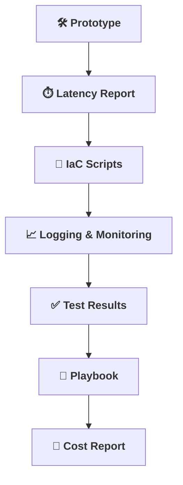

[⬅ Back to System Build & Readiness Overview](README.md)

# 📦 System Build & Readiness Deliverables

> **What you'll walk away with from this step:**

---

- **🛠️ Working End-to-End Prototype:**  
  A fully integrated, user-ready AI system for the chosen use case.

- **⏱️ Measured Inference Latency Report:**  
  Evidence of real-world performance.

- **📜 IaC Scripts:**  
  Infrastructure as Code for reproducible deployments.

- **📈 Logging & Monitoring Plan:**  
  Documentation of observability and monitoring.

- **✅ Test Results Summary:**  
  Proof of reliability and correctness.

- **📒 Operational Playbook Snippets:**  
  Ready-to-use operational procedures.

- **💸 Final Cost Report:**  
  Actual resource and cloud costs, with optimization recommendations.

---

---

> **Professional Insight:**  
> These deliverables prove ability to deliver production-ready, reliable AI systems.
