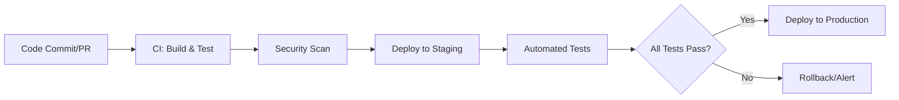

[⬅ Back to Key Activities Overview](Key_Activities.md)  
[⬅ Back to System Build & Readiness Overview](README.md)

# 🚀 Deployment & Infrastructure

> **Purpose:**  
> Deploy solution with confidence using modern, repeatable infrastructure practices.

---

## 🐳 Dockerization

- Containerize all components for portability and consistency.

---

## 🏗️ Infrastructure as Code (IaC)

- Use tools like Terraform or CloudFormation for reproducible environments.

---

## ☁️ Cloud Service Integration

- Integrate with cloud platforms for scalability and reliability.

---

## 🔄 Automated Deployment Pipelines (CI/CD)

- All code, models, and infrastructure changes are deployed via automated CI/CD pipelines.
- Pipelines are implemented using tools such as **GitHub Actions**, **Azure DevOps**, or **GitLab CI**.
- Pipelines include build, test, security scan, deploy, and rollback steps for both application and infrastructure.

---

## 🛡️ Automated Security Scans

- Static and dynamic security scans are integrated into the CI/CD pipeline.
- Tools such as **Snyk**, **SonarQube**, or **Bandit** are used to detect vulnerabilities in code and dependencies.
- Security checks are enforced before deployment to production.

---

## 🛠️ CI/CD Workflow Example

Below is a sample CI/CD pipeline for this project:

```yaml
# .github/workflows/ci-cd.yml
name: CI/CD Pipeline

on:
  push:
    branches: [main]
  pull_request:
    branches: [main]

jobs:
  build-test:
    runs-on: ubuntu-latest
    steps:
      - uses: actions/checkout@v3
      - name: Set up Python
        uses: actions/setup-python@v4
        with:
          python-version: "3.10"
      - name: Install dependencies
        run: pip install -r requirements.txt
      - name: Run tests
        run: pytest --cov

  deploy:
    needs: build-test
    runs-on: ubuntu-latest
    steps:
      - name: Deploy to Cloud
        run: ./deploy.sh
```

Or, visualize the CI/CD flow:



---

> **Professional Insight:**  
> Modern deployment is automated, repeatable, and cloud-ready for every AI project.

> **Automation Insight:**  
> CI/CD pipelines accelerate delivery, reduce manual errors, and enable rapid iteration.

> **Automation Insight:**  
> Automated security scanning helps catch vulnerabilities early and ensures compliance.
