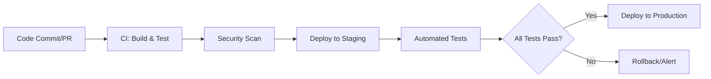

[⬅ Back to Section Overview](README.md)

[⬅ Back to Main Index](../../INDEX.md)

# 🚀 Deployment & Infrastructure

> **Purpose:**
> Deploy the AI solution with confidence using modern, repeatable infrastructure practices.

---

## 🐳 Dockerization

- Containerize all components for portability and consistency.
- **Example Dockerfile:**
  ```dockerfile
  FROM python:3.10-slim
  WORKDIR /app
  COPY requirements.txt .
  RUN pip install -r requirements.txt
  COPY . .
  CMD ["python", "src/main.py"]
  ```

---

## 🏗️ Infrastructure as Code (IaC)

- Use tools like **Terraform** or **CloudFormation** for reproducible environments.
- Define infrastructure as code for scalability and disaster recovery.
- **Example Terraform Snippet:**
  ```hcl
  resource "aws_instance" "example" {
    ami           = "ami-0c55b159cbfafe1f0"
    instance_type = "t2.micro"
    tags = {
      Name = "AI-Deployment"
    }
  }
  ```

---

## ☁️ Cloud Service Integration

- Integrate with cloud platforms for scalability and reliability.
- **Target Platforms:**
  - **AWS:** ECS, Lambda, S3, CloudWatch.
  - **Azure:** AKS, Blob Storage, Monitor.
  - **GCP:** GKE, Cloud Functions, Stackdriver.
- **Example:**
  - Deploy containers using **AWS ECS** with auto-scaling policies.

---

## 🔄 Automated Deployment Pipelines (CI/CD)

- Automate deployment, testing, and updates using CI/CD pipelines.
- Pipelines include build, test, security scan, deploy, and rollback steps for both application and infrastructure.
- **Example Workflow:**
  ```yaml
  name: CI/CD Pipeline
  on:
    push:
      branches: [main]
    pull_request:
      branches: [main]
  jobs:
    build-test:
      runs-on: ubuntu-latest
      steps:
        - uses: actions/checkout@v3
        - name: Set up Python
          uses: actions/setup-python@v4
          with:
            python-version: "3.10"
        - name: Install dependencies
          run: pip install -r requirements.txt
        - name: Run tests
          run: pytest --cov

    deploy:
      needs: build-test
      runs-on: ubuntu-latest
      steps:
        - name: Deploy to Cloud
          run: ./deploy.sh
  ```

---

## 🛡️ Automated Security Scans

- Integrate static and dynamic security scans into the CI/CD pipeline.
- Tools such as **Snyk**, **SonarQube**, or **Bandit** are used to detect vulnerabilities in code and dependencies.
- Security checks are enforced before deployment to production.

---

## 🛠️ CI/CD Workflow Example

Below is a visual representation of the CI/CD pipeline:



---

## Future Roadmap

- **Multi-Region Deployment:** Ensure high availability across regions.
- **Advanced Monitoring:** Integrate tools like Prometheus and Grafana for infrastructure monitoring.
- **Self-Healing:** Implement automated recovery mechanisms for failed deployments.

---

> **Professional Insight:**
> Modern deployment is automated, repeatable, and cloud-ready for every AI project.

> **Automation Insight:**
> CI/CD pipelines accelerate delivery, reduce manual errors, and enable rapid iteration.

> **Security Insight:**
> Automated security scanning helps catch vulnerabilities early and ensures compliance.

---

## Navigation

[⬅ Back to Documentation Index](../../INDEX.md)

---

## Last Updated

- 2025-06-21
