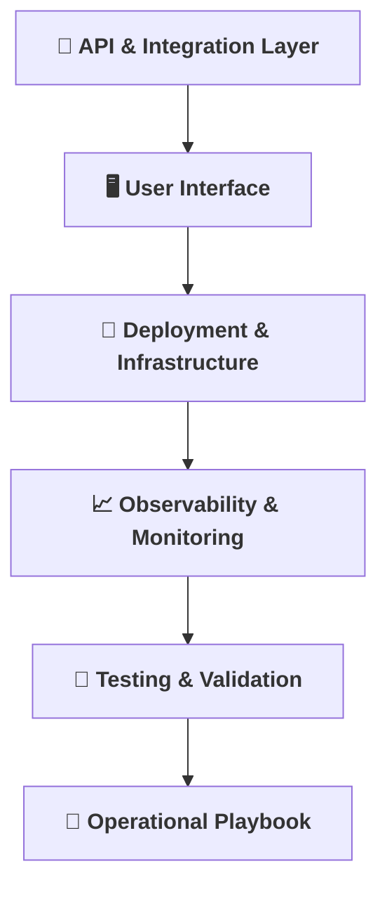

[⬅ Back to System Build & Readiness Overview](README.md)

# 🗝️ Key Activities Overview

> **My roadmap for building a production-ready AI system.**  
> Each activity below is a critical step in delivering a robust, usable product for any AI use case.

---

---

- [🔌 API & Integration Layer](API_Integration.md): Expose AI to the world.
- [🖥️ User Interface](User_Interface.md): Make it usable and beautiful.
- [🚀 Deployment & Infrastructure](Deployment_Infrastructure.md): Deploy with confidence and repeatability.
- [📈 Observability & Monitoring](Observability_Monitoring.md): Know what’s happening, always.
- [🧪 Testing & Validation](Testing_Validation.md): Prove it works, end-to-end.
- [📒 Operational Playbook](Operational_Playbook.md): Prepare for real-world operations.

---
