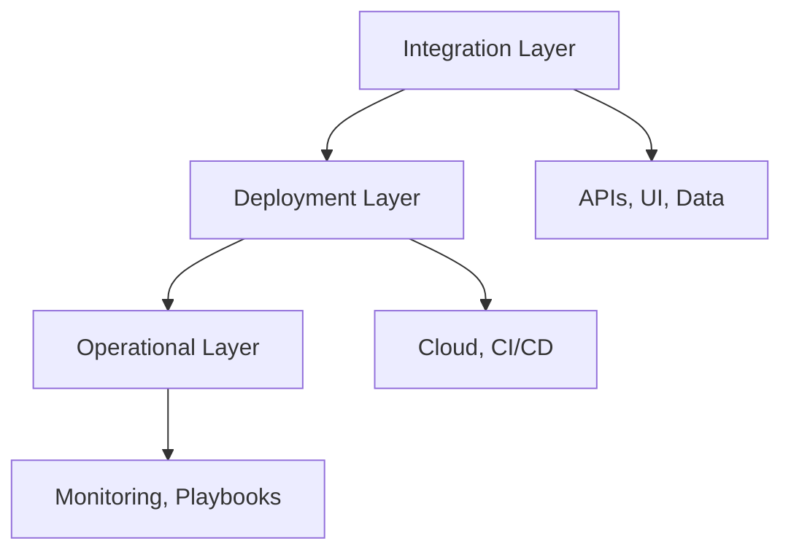

[⬅ Back to Section Overview](README.md)

[⬅ Back to Main Index](../../INDEX.md)

# 🎯 Objective

> ## 🏗️ Integrate, deploy, and operationalize AI solution
>
> as a robust, production-ready system—ensuring usability, scalability, and maintainability.

---

## Integration Objectives
- **Modular Architecture:** Ensure the AI system is modular and can integrate seamlessly with external workflows and APIs.
- **API Design:** Develop RESTful or GraphQL APIs to expose AI functionality.
- **Data Compatibility:** Ensure compatibility with existing data sources and downstream applications.

---

## Deployment Objectives
- **Scalability:** Deploy the AI system in a cloud-based environment (e.g., AWS, Azure, GCP) to handle varying workloads.
- **Portability:** Use containerization (e.g., Docker) for reproducibility and portability.
- **Automation:** Implement CI/CD pipelines for automated deployment and updates.

---

## Operationalization Objectives
- **Monitoring:** Set up observability tools (e.g., Prometheus, Grafana) for metrics, dashboards, and alerts.
- **Governance:** Ensure compliance with data privacy and security standards.
- **Incident Management:** Develop operational playbooks for handling incidents and updates.

---

## Visual Overview

---

> **Professional Insight:**
> This phase is about turning intelligence into impact—making AI accessible, reliable, and ready for the real world.

---

## Navigation

[⬅ Back to Documentation Index](../../INDEX.md)

---

## Last Updated

- 2025-06-21
