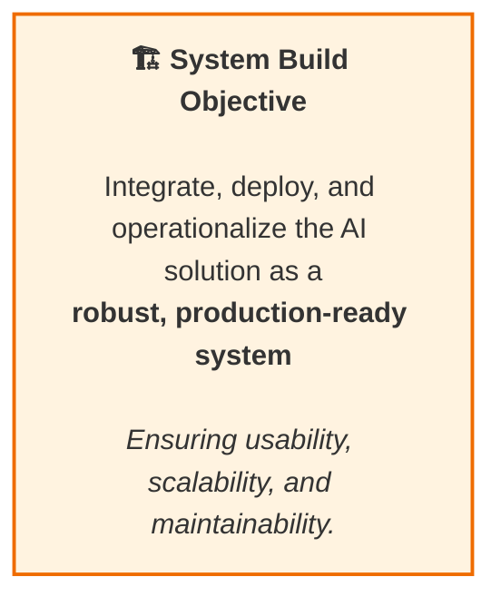

[⬅ Back to Section Overview](README.md)

[⬅ Back to Main Index](../../../INDEX.md#build)

# 🎯 Objective

> ## 🏗️ Integrate, deploy, and operationalize AI solution
>
> as a robust, production-ready system—ensuring usability, scalability, and maintainability.

---

---

> **Professional Insight:**  
> This phase is about turning intelligence into impact—making AI accessible, reliable, and ready for the real world.