[⬅ Back to Section Overview](README.md)

[⬅ Back to Main Index](../../INDEX.md)

# 📈 Observability & Monitoring

> **Purpose:**  
> Build in visibility and insight from day one—know what’s happening, always.

---

## Quick Links

- [Metrics Collection](#metrics-collection)
- [Monitoring Dashboard](#monitoring-dashboard)
- [Tracing & Logging](#tracing--logging)
- [Bias & Fairness Monitoring](#bias--fairness-monitoring)
- [Automated Alerting](#automated-alerting)
- [Visual Overview](#visual-overview)
- [Future Roadmap](#future-roadmap)

---

## 📊 Metrics Collection

- Track key system and business metrics.
- **Performance Metrics:** Latency, throughput, error rates.
- **Resource Metrics:** CPU, memory, disk usage.
- **AI-Specific Metrics:** Model accuracy, drift detection, bias monitoring.
- Expose metrics for dashboards and alerts using tools like **Prometheus**, **Grafana**, or **AWS CloudWatch**.
- **Example Prometheus Configuration:**  
  ```yaml
  scrape_configs:
    - job_name: "ai_system"
      static_configs:
        - targets: ["localhost:9090"]
  ```

---

## 🖥️ Monitoring Dashboard

- Build or integrate a simple dashboard for real-time monitoring.
- Use tools like **Grafana**, **Kibana**, or **AWS CloudWatch Dashboards**.
- Include visualizations for:
  - Latency and throughput trends.
  - Resource utilization (CPU, memory, disk).
  - Model-specific metrics (accuracy, drift, bias).
- **Example Grafana Dashboard Panel:**  
  ```json
  {
    "type": "graph",
    "title": "Latency Trends",
    "targets": [
      {
        "expr": "http_request_duration_seconds",
        "legendFormat": "{{method}}"
      }
    ]
  }
  ```

---

## 🔍 Tracing & Logging

- Implement tracing for request flows and performance bottlenecks.
- Use tools like **Jaeger**, **Zipkin**, or **AWS X-Ray**.
- Ensure logs are structured and actionable.
- **Example Log Format:**  
  ```json
  {
    "timestamp": "2025-06-21T12:00:00Z",
    "endpoint": "/api/v1/ai/predict",
    "status": 200,
    "response_time_ms": 123,
    "error": null
  }
  ```

---

## ⚖️ Bias & Fairness Monitoring

- Implement metrics and dashboards to monitor for model bias and fairness in production.
- Regularly review outputs for disparate impact or unintended consequences.
- Use tools like **AI Fairness 360** or **What-If Tool** for proactive bias detection.
- **Example Bias Metric Visualization:**  
  ```json
  {
    "metric": "disparate_impact",
    "value": 0.85,
    "threshold": 0.80,
    "status": "acceptable"
  }
  ```

---

## 🚨 Automated Alerting

- Configure automated alerts for critical metrics (e.g., errors, latency, drift, cost overruns).
- Integrate with channels such as **email**, **Slack**, or **PagerDuty** for real-time notifications.
- Alerts are triggered on threshold breaches or system failures to enable rapid response.
- **Example Alert Configuration:**  
  ```yaml
  alert:
    name: High Latency
    condition: latency > 500ms
    actions:
      - notify: slack
      - notify: pagerduty
  ```

---

## Visual Overview

```mermaid
graph TD
    metrics["<b>📊 Metrics</b>"]
    dashboard["<b>🖥️ Dashboard</b>"]
    tracing["<b>🔍 Tracing & Logging</b>"]
    bias["<b>⚖️ Bias & Fairness Monitoring</b>"]
    alert["<b>🚨 Automated Alerting</b>"]
    metrics --> dashboard
    dashboard --> tracing
    tracing --> bias
    bias --> alert
```



---

## Future Roadmap

- **Advanced Monitoring:** Integrate AI-specific tools for explainability and fairness tracking.
- **Self-Healing Systems:** Automate incident response and recovery mechanisms.
- **Scalability:** Expand monitoring to multi-region deployments for high availability.

---

> **Professional Insight:**  
> Observability is essential for reliability and rapid troubleshooting in any AI deployment. Proactive monitoring ensures system health and builds trust in AI solutions.

---

## Navigation

[⬅ Back to Documentation Index](../../INDEX.md)

---

## Last Updated

- 2025-06-21