```mermaid
graph TD
    metrics["<b>📊 Metrics</b>"]
    dashboard["<b>🖥️ Dashboard</b>"]
    tracing["<b>🔍 Tracing & Logging</b>"]
    bias["<b>⚖️ Bias & Fairness Monitoring</b>"]
    alert["<b>🚨 Automated Alerting</b>"]
    metrics --> dashboard
    dashboard --> tracing
    tracing --> bias
    bias --> alert
```

[⬅ Back to Key Activities Overview](Key_Activities.md)  
[⬅ Back to System Build & Readiness Overview](README.md)

# 📈 Observability & Monitoring

> **Purpose:**  
> Build in visibility and insight from day one—know what’s happening, always.

---

## 📊 Metrics Collection

- Track key system and business metrics.
- Expose metrics for dashboards and alerts.

---

## 🖥️ Monitoring Dashboard

- Build or integrate a simple dashboard for real-time monitoring.

---

## 🔍 Tracing & Logging

- Implement tracing for request flows and performance bottlenecks.
- Ensure logs are structured and actionable.

---

## ⚖️ Bias & Fairness Monitoring

- Implement metrics and dashboards to monitor for model bias and fairness in production.
- Regularly review outputs for disparate impact or unintended consequences.

---

## 🚨 Automated Alerting

- Configure automated alerts for critical metrics (e.g., errors, latency, drift, cost overruns).
- Integrate with channels such as **email**, **Slack**, or **PagerDuty** for real-time notifications.
- Alerts are triggered on threshold breaches or system failures to enable rapid response.

---

---

> **Professional Insight:**  
> Observability is essential for reliability and rapid troubleshooting in any AI deployment.