```mermaid
graph TD
    drift["<b>🕵️ Model Drift & Bias</b>"]
    update["<b>🔄 Model Update</b>"]
    incident["<b>🚨 Incident Response</b>"]
    version["<b>🗂️ Version Control</b>"]
    heal["<b>🔄 Self-Healing</b>"]
    drift --> update
    update --> incident
    incident --> version
    version --> heal
```

[⬅ Back to Key Activities Overview](Key_Activities.md)  
[⬅ Back to System Build & Readiness Overview](README.md)

# 📒 Operational Playbook

> **Purpose:**  
> Prepare for real-world operations—know how to monitor, update, and respond for any AI solution.

---

## 🕵️ Monitoring for Model Drift & Bias

- Track model performance over time and detect drift.
- Automated alerts for significant changes in model performance or output distribution.
- Scheduled audits for bias and fairness using real-world data.
- Mitigation steps include retraining, feature review, and stakeholder consultation.

---

## 🔄 Model Update/Retraining Process

- Define how and when to update or retrain models.

---

## 🚨 Incident Response

- Document steps for handling failures or incidents.

---

## 🗂️ Version Control for Data & Models

- Ensure all data and models are versioned and auditable.
- Maintain a registry of all deployed models.
- Procedures for rollback and deprecation are part of operational readiness.

---

## 🔄 Self-Healing & Automated Remediation

- Implement automated remediation for common failures (e.g., auto-restart services, switch to fallback models).
- Monitor system health and trigger self-healing scripts when issues are detected.
- Document self-healing logic and escalation paths for unresolved incidents.

---

---

> **Professional Insight:**  
> Operational readiness is what turns a prototype into a product—make it robust for every AI solution.