[⬅ Back to Section Overview](README.md)

[⬅ Back to Main Index](../../INDEX.md)

# 📒 Operational Playbook

> **Purpose:**
> Prepare for real-world operations—know how to monitor, update, and respond for any AI solution.

---

## 🕵️ Monitoring for Model Drift & Bias

- Track model performance over time and detect drift using tools like **Evidently AI** or **AWS SageMaker Model Monitor**.
- Automated alerts for significant changes in model performance or output distribution.
- Scheduled audits for bias and fairness using real-world data.
- Mitigation steps include:
  - Retraining models with updated datasets.
  - Reviewing features for fairness.
  - Consulting stakeholders for ethical considerations.
- **Example Drift Threshold Configuration:**
  ```yaml
  drift_thresholds:
    accuracy: 0.85
    drift: 0.10
  ```
- **Example Fairness Metric Visualization:**
  ```json
  {
    "metric": "equal_opportunity",
    "value": 0.92,
    "threshold": 0.90,
    "status": "acceptable"
  }
  ```

---

## 🔄 Model Update/Retraining Process

- Define workflows for updating or retraining models:
  - **Trigger Conditions:** Model drift, new data availability, or performance degradation.
  - **Steps:**
    - Data preparation and validation.
    - Model retraining and testing.
    - Deployment and monitoring.
- Use CI/CD pipelines for automated retraining and deployment.
- **Example Workflow:**
  ```yaml
  retraining_pipeline:
    steps:
      - prepare_data: "Clean and validate new data."
      - retrain_model: "Train model with updated data."
      - test_model: "Run performance tests."
      - deploy_model: "Deploy updated model to production."
  ```

---

## 🚨 Incident Response

- Document steps for handling failures or incidents:
  - **Failure Scenarios:**
    - Model performance degradation: Roll back to the previous version.
    - Infrastructure failures: Use self-healing mechanisms (e.g., Kubernetes auto-restart).
  - **Response Workflow:**
    - Detect -> Notify -> Diagnose -> Resolve -> Document.
- **Example Incident Playbook:**
  ```yaml
  incident_response:
    steps:
      - detect: "Monitor alerts for failures."
      - notify: "Alert stakeholders via Slack or PagerDuty."
      - diagnose: "Analyze logs and metrics."
      - resolve: "Apply fixes or rollbacks."
      - document: "Record incident details for future reference."
  ```
- **Example Log Analysis During Diagnosis:**
  ```json
  {
    "timestamp": "2025-06-21T12:00:00Z",
    "error_type": "model_drift",
    "details": "Accuracy dropped below threshold (0.85).",
    "action_taken": "Triggered retraining pipeline."
  }
  ```

---

## 🗂️ Version Control for Data & Models

- Ensure all data and models are versioned and auditable.
- Maintain a registry of all deployed models with metadata (e.g., version, deployment date, performance metrics).
- Procedures for rollback and deprecation:
  - Rollback to previous versions in case of failures.
  - Deprecate outdated models with proper documentation.
- Use tools like **DVC** or **MLflow** for version control.

---

## 🔄 Self-Healing & Automated Remediation

- Implement automated remediation for common failures:
  - Auto-restart services for infrastructure issues.
  - Switch to fallback models during model failures.
- Monitor system health and trigger self-healing scripts when issues are detected.
- Document self-healing logic and escalation paths for unresolved incidents.
- **Example Self-Healing Workflow:**
  ```yaml
  self_healing:
    triggers:
      - service_unavailable: "Restart service automatically."
      - model_failure: "Switch to fallback model."
    escalation:
      - unresolved: "Notify engineering team for manual intervention."
  ```

---

## Visual Overview

```mermaid
graph TD
    drift["<b>🕵️ Model Drift & Bias</b>"]
    update["<b>🔄 Model Update</b>"]
    incident["<b>🚨 Incident Response</b>"]
    version["<b>🗂️ Version Control</b>"]
    heal["<b>🔄 Self-Healing</b>"]
    drift --> update
    update --> incident
    incident --> version
    version --> heal
```



---

## Future Roadmap

- **Automated Incident Response:** Integrate self-healing mechanisms for faster recovery.
- **Advanced Bias Mitigation:** Develop real-time fairness monitoring tools.
- **Lifecycle Management:** Expand workflows for continuous improvement.
- **Example Lifecycle Management Workflow:**
  ```yaml
  lifecycle_management:
    triggers:
      - new_data_available: "Start retraining pipeline automatically."
      - performance_degradation: "Validate and deploy updated model."
  ```

---

> **Professional Insight:**
> Operational readiness is what turns a prototype into a product—make it robust for every AI solution.

---

## Navigation

[⬅ Back to Documentation Index](../../INDEX.md)

---

## Last Updated

- 2025-06-21
