```mermaid
graph TD
    unit["<b>🧪 Unit Tests</b>"]
    integration["<b>🔗 Integration Tests</b>"]
    e2e["<b>🧑‍💻 End-to-End Tests</b>"]
    perf["<b>⚡ Performance Tests</b>"]
    auto["<b>🤖 Automated Test Coverage</b>"]
    unit --> integration
    integration --> e2e
    e2e --> perf
    perf --> auto
```

[⬅ Back to Section Overview](README.md)

[⬅ Back to Main Index](../../INDEX.md)

# 🧪 Testing & Validation

> **Purpose:**  
> Prove the system works—at every level, for every AI solution.

---

## 🧪 Unit & Integration Tests

- Write comprehensive tests for all components and integrations.

---

## 🧑‍💻 End-to-End & Performance Testing

- Simulate real user flows and measure system performance.

---

## 🤖 Automated Test Coverage & Tooling

- All unit, integration, and end-to-end tests are automated and run as part of the CI/CD pipeline.
- Test coverage is measured and reported for every commit.
- Recommended frameworks/tools:
  - **Python:** pytest, unittest, Selenium (for UI), coverage.py
  - **JavaScript/TypeScript:** Jest, Mocha, Cypress, Playwright
  - **API:** Postman/Newman, REST Assured

---

---

> **Professional Insight:**  
> Automated testing ensures reliability, speeds up delivery, and prevents regressions for every AI project.

> **Automation Insight:**  
> Automated testing ensures reliability, speeds up delivery, and prevents regressions.