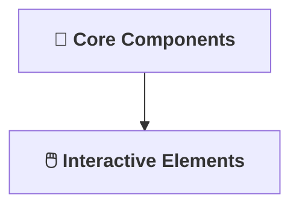

[⬅ Back to Section Overview](README.md)

[⬅ Back to Main Index](../../INDEX.md)

# 🖥️ User Interface

> **Purpose:**
> Deliver a functional, intuitive, and visually appealing interface for the AI solution.

---

## 🧩 Core UI Components

- Build reusable, accessible UI components.
- Focus on clarity, responsiveness, and usability.

---

## 🖱️ Interactive Elements

- Enable user-driven exploration and feedback.
- Provide clear loading, error, and success states.

---

---

> **Professional Insight:**
> The user interface is where the AI meets the world—make it count for every project.
