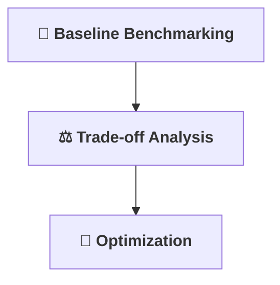

[⬅ Back to Key Activities Overview](Key_Activities.md)  
[⬅ Back to AI Core & Optimization Overview](README.md)

# 📊 Benchmarking & Optimization

> **Purpose:**  
> Measure, analyze, and optimize the AI for real-world performance and efficiency, regardless of the application.

---

## 📏 Resource Benchmarking

- Establish baselines for speed, memory, and cost.
- Analyze trade-offs and bottlenecks.

---

## 🚀 Optimization Analysis

- Tune models and pipelines for maximum efficiency.
- Document all changes and their impact.

---

## 💸 Ongoing Cost Tracking

- Resource usage and cloud costs are tracked for all experiments and deployments.
- Cost optimization is a key metric in benchmarking and reporting.

---

---

> **Professional Insight:**  
> Optimization is not just about speed—it's about delivering value efficiently for every AI solution.
