```mermaid
graph TD
    base["<b>📏 Baseline Benchmarking</b>"]
    trade["<b>⚖️ Trade-off Analysis</b>"]
    opt["<b>🚀 Optimization</b>"]
    base --> trade
    trade --> opt
```

[⬅ Back to Section Overview](README.md)

[⬅ Back to Main Index](../../../INDEX.md#core)

# 📊 Benchmarking & Optimization

> **Purpose:**  
> Measure, analyze, and optimize the AI for real-world performance and efficiency, regardless of the application.

---

## 📏 Resource Benchmarking

- Establish baselines for speed, memory, and cost.
- Analyze trade-offs and bottlenecks.

---

## 🚀 Optimization Analysis

- Tune models and pipelines for maximum efficiency.
- Document all changes and their impact.

---

## 💸 Ongoing Cost Tracking

- Resource usage and cloud costs are tracked for all experiments and deployments.
- Cost optimization is a key metric in benchmarking and reporting.

---

---

## Benchmarking & Optimization Results

| r  | alpha | dropout | top-1 | MRR  | runtime | mem(MB) |
|----|-------|---------|-------|------|---------|---------|
| 4  | 16    | 0.0     | 0.00  | 0.02 | 1.61    | 139.46  |
| 4  | 16    | 0.1     | 0.00  | 0.03 | 4.95    | 142.46  |
| ...| ...   | ...     | ...   | ...  | ...     | ...     |

**Interpretation:**  
With the current dataset size, all hyperparameter configurations yield similar (low) retrieval metrics. No clear trade-off between accuracy and resource usage is observed. To see meaningful optimization, we recommend expanding the dataset to 1000+ chunks.

**Next Steps:**  
- Expand dataset for more robust benchmarking.
- Re-run hyperparameter sweep and update this analysis.

---

> **Professional Insight:**  
> Optimization is not just about speed—it's about delivering value efficiently for every AI solution.