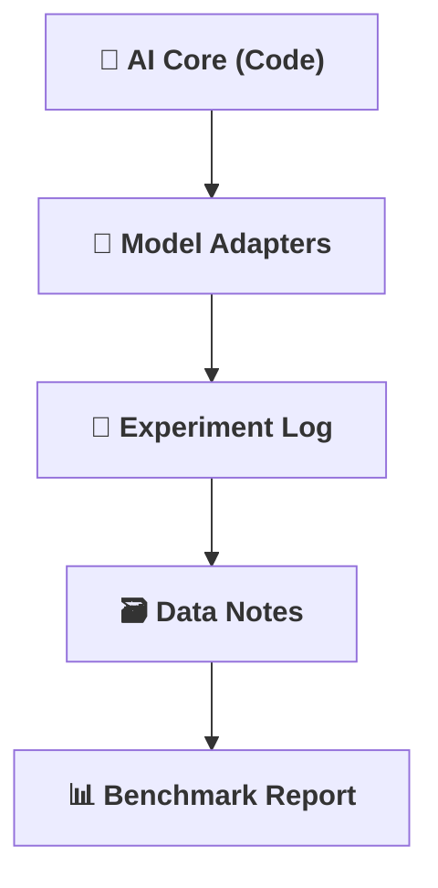

[⬅ Back to AI Core & Optimization Overview](README.md)

# 📦 AI Core & Optimization Deliverables

> **What you'll walk away with from this step:**

---

- **🧠 Functional AI Core (Code):**  
  A working, production-ready AI implementation for the selected use case.

- **🔧 Fine-tuned Model Adapters (if applicable):**  
  Custom model adapters for enhanced performance.

- **📓 Detailed Experimentation Log:**  
  Transparent record of experiments, results, and insights.

- **🗃️ Data Governance & Processing Notes:**  
  Documentation of data flows, privacy, and governance.

- **📊 Benchmark & Optimization Report:**  
  Evidence of measured, optimized performance.

- **💸 Cost Tracking Report:**  
  Ongoing resource and cloud cost tracking and optimization.

---

## 📝 Stakeholder Review Table

| Deliverable                | Reviewed By | Feedback Summary                | Status      | Notes                |
|----------------------------|-------------|---------------------------------|-------------|----------------------|
| Functional AI Core (Code)  |             |                                 | Pending     |                      |
| Model Adapters             |             |                                 | Pending     |                      |
| Experimentation Log        |             |                                 | Pending     |                      |
| Data Governance Notes      |             |                                 | Pending     |                      |
| Benchmark Report           |             |                                 | Pending     |                      |
| Cost Tracking Report       |             |                                 | Pending     |                      |

---

---

> **Professional Insight:**  
> These deliverables prove ability to deliver, measure, and optimize real AI solutions—no matter the domain.
