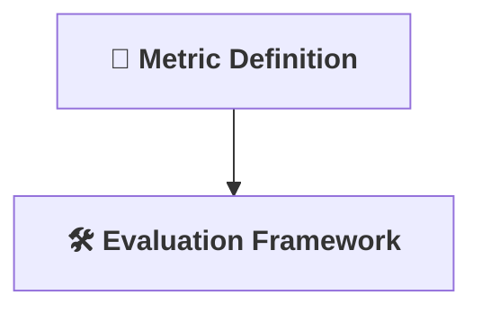

[⬅ Back to Key Activities Overview](Key_Activities.md)  
[⬅ Back to AI Core & Optimization Overview](README.md)

# 🧪 Evaluation Plan

> **Purpose:**  
> Define, automate, and document how you measure AI success for the chosen use case.

---

## 🎯 Metric Definition

- Choose metrics that reflect business and technical goals (accuracy, latency, cost, etc.).

---

## 🛠️ Evaluation Framework

- Implement automated evaluation scripts and dashboards.
- Ensure reproducibility and transparency.

---

---

> **Professional Insight:**  
> Automated, transparent evaluation is the mark of a mature AI workflow—adapt the metrics to each project.
