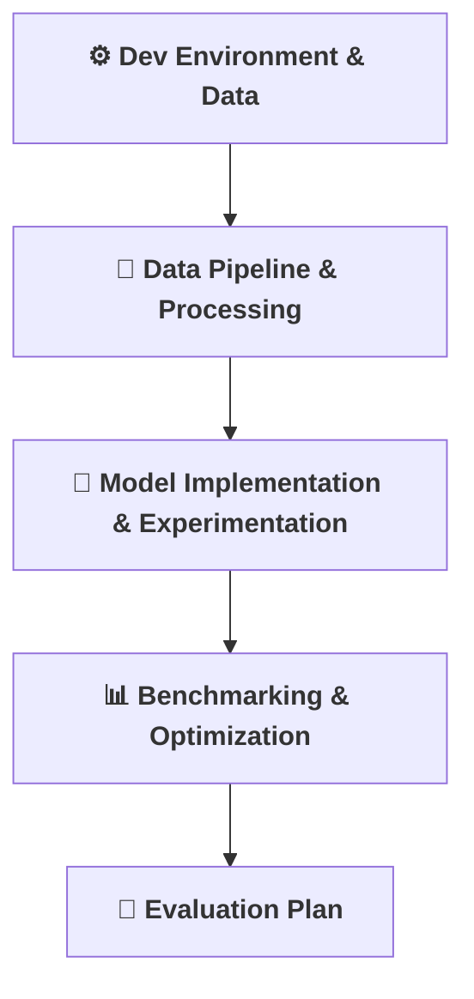

[⬅ Back to Section Overview](README.md)

[⬅ Back to Main Index](../../INDEX.md)

# 🗝️ Key Activities Overview

> **Roadmap for building a production-grade AI core.**
> Each activity below is a critical step in delivering measurable, reliable intelligence for any AI project.

---

---

- [⚙️ Dev Environment & Data](Dev_Environment_Data.md): Set up tools and gather data.
- [🔗 Data Pipeline & Processing](Data_Pipeline_Processing.md): Build robust, scalable data flows.
- [🤖 Model Implementation & Experimentation](Model_Implementation_Experimentation.md): Implement and test AI.
- [📊 Benchmarking & Optimization](Benchmarking_Optimization.md): Measure and tune for performance.
- [🧪 Evaluation Plan](Evaluation_Plan.md): Automate and document evaluation.

---
