```mermaid
graph TD
    style Obj2 fill:#e3f2fd,stroke:#1565c0,stroke-width:2px
    Obj2["<b>🧠 AI Core Objective</b><br><br>Implement a robust, efficient, and measurable AI core for the<br><b>AI solution</b><br><br><i>Balancing performance, resource use, and business value.</i>"]
```

[⬅ Back to Section Overview](README.md)

[⬅ Back to Main Index](../../INDEX.md)

# 🎯 Objective

> ## 🧠 Implement a robust, efficient, and measurable AI core
>
> for the selected AI solution—balancing performance, resource use, and business value.

---

---

> **Professional Insight:**  
> This phase is about building intelligence with discipline—measuring, optimizing, and documenting every step, no matter the use case.

# 🎯 Core Objective

## Purpose

Define the core implementation goals and measurable success metrics for CodeCraft AI’s AI-powered coding assistant.

---

## Implementation Goals

- **Production-Ready Code Generation:**  
  Generate context-aware, high-quality code, unit tests, and deployment assets that adhere to OOP, SOLID, and security best practices.
- **Retrieval-Augmented Generation (RAG):**  
  Integrate a retrieval layer to provide up-to-date, relevant information for code synthesis, minimizing hallucination.
- **Extensible & Modular Architecture:**  
  Design the system for easy integration of new languages, frameworks, and deployment targets.
- **Developer Experience:**  
  Deliver fast, intuitive API and UI interfaces for seamless adoption by individual developers and teams.
- **Operational Excellence:**  
  Embed observability, CI/CD, automated testing, and security from the start.

---

## Success Metrics

- **Code Quality:**
  > 90% of generated code passes static analysis and unit tests on first run.
- **Latency:**  
  < 3 seconds average response time for code generation requests.
- **User Satisfaction:**
  > 80% positive feedback in user testing or pilot deployments.
- **Coverage:**  
  Support for at least 3 programming languages and 2 deployment environments at launch.
- **Operational Readiness:**  
  100% automated test coverage for core modules; CI/CD pipeline in place.

---

> **Sage Wisdom:**  
> “Clear objectives and measurable outcomes are the compass for every successful AI implementation. Let these guide every design and delivery decision.”