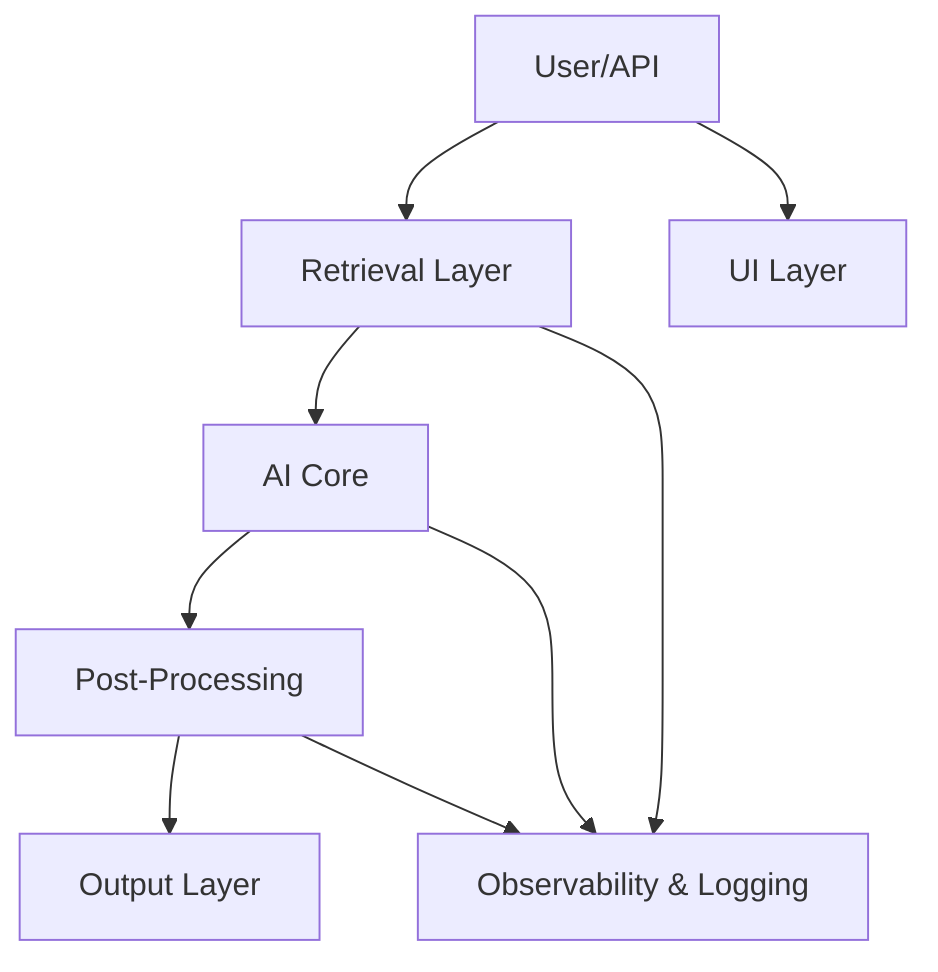

[⬅ Back to Section Overview](README.md)

[⬅ Back to Main Index](../../INDEX.md)

# 🏗️ Architecture Blueprint

> **Purpose:**  
> Design a modular, secure, and scalable architecture for CodeCraft AI, embedding MLOps, observability, and data governance from the start.

---

## 🧩 System Layers

- **Input/API Layer:**
  - Accepts user prompts, tech stack preferences, and optional code context via REST/GraphQL API.
  - _Design Pattern:_ Facade pattern to provide a unified interface for diverse input types.
- **Retrieval Layer (RAG):**
  - Uses embeddings to fetch relevant code snippets, documentation, and best practices from curated sources.
  - _Design Pattern:_ Strategy pattern for pluggable retrieval sources.
- **AI Core:**
  - Large Language Model (LLM) for code synthesis, leveraging retrieved context for up-to-date, accurate suggestions.
  - _Design Pattern:_ Adapter pattern to support multiple LLM providers.
- **Post-Processing Layer:**
  - Applies code formatting, linting, and security checks.
- **Output Layer:**
  - Returns generated code, tests, and deployment assets to the user.
- **UI Layer (optional/demo):**
  - Web interface for interactive use and demonstration.
- **Observability & Logging:**
  - Centralized logging, metrics, and tracing for all components.

---

## 🖼️ Architecture Diagram



---

## 🔒 Data Privacy & Compliance

- **Data Minimization:**  
  Only collect and process the minimum data required for code generation and retrieval.
- **User Consent:**  
  Do not store user prompts, code, or context unless explicit consent is given.
- **Data Retention:**  
  Automatically delete transient data after processing unless retention is required and consented.
- **Access Controls:**  
  Restrict access to sensitive data and logs using role-based access control (RBAC).
- **Encryption:**  
  Use encryption in transit (TLS) and at rest for any stored data or logs.
- **Compliance Standards:**  
  Design and document all data flows to align with GDPR, CCPA, and other relevant privacy regulations.
- **Auditability:**  
  Maintain audit logs for all access to user data and model outputs.
- **Third-Party Services:**  
  Ensure all integrated APIs and services meet the privacy and compliance standards.

---

## 🛡️ Security Threat Model

| Threat              | Vector                       | Mitigation                                    |
| ------------------- | ---------------------------- | --------------------------------------------- |
| Prompt Injection    | Malicious user input         | Input validation, output sanitization         |
| API Abuse           | Excessive/automated requests | Rate limiting, API keys, monitoring           |
| Data Leakage        | Sensitive info in prompts    | Do not store prompts, encrypt in transit/rest |
| Supply Chain Attack | Third-party dependencies     | Regular audits, pin dependencies              |

---

## 📑 API Contract Example

**Request:**

```json
{
  "prompt": "Create a REST API in FastAPI for user management",
  "tech_stack": ["Python", "FastAPI", "PostgreSQL"],
  "context": "Existing user model provided"
}
```

**Response:**

```json
{
  "code": "...generated code...",
  "unit_tests": "...generated tests...",
  "deployment": ["Dockerfile", "k8s.yaml"],
  "explanation": "Follows SOLID, includes JWT auth, async endpoints"
}
```

---

> **Professional Insight:**  
> A modular, layered architecture ensures CodeCraft AI is maintainable, extensible, and secure—ready for both rapid prototyping and enterprise deployment.