```mermaid
graph TD
    problem["<b>👤 User Profile & Pain Points</b>"]
    value["<b>💡 Value Proposition & ROI</b>"]
    iospec["<b>📝 Input & Output Specification</b>"]
    problem --> value
    value --> iospec
```

[⬅ Back to Section Overview](README.md)

[⬅ Back to Main Index](../../INDEX.md)

# 🔍 Business Problem & Value

> **Purpose:**
> Identify user needs, clarify the business value, and define clear input/output requirements for the AI solution.

---

## 👤 User Profile & Pain Points

- **Target Users:**
  - Professional software developers, engineering teams, and technical leads.
  - **User Personas:**
    - _Senior Backend Engineer_: Needs rapid prototyping and robust code patterns.
    - _Startup CTO_: Seeks to accelerate delivery and reduce onboarding friction.
    - _DevOps Lead_: Wants consistent, secure deployment assets.
- **Pain Points:**
  - Time wasted searching for code examples, boilerplate, or best practices.
  - Difficulty keeping up with evolving frameworks, libraries, and language features.
  - Inconsistent code quality and lack of automated test coverage.
  - Onboarding friction for new team members.

---

## 💡 Value Proposition & ROI

- **Business Value:**
  CodeCraft AI accelerates software delivery by generating production-ready code, reducing manual effort, and minimizing errors.
- **Cost Savings:**
  - Reduces developer time spent on boilerplate and research by up to 50%.
  - Lowers onboarding costs for new team members by providing instant, context-aware code examples.
- **Strategic Leverage:**
  - Enables rapid prototyping and faster go-to-market for new features.
  - Improves code quality and consistency across teams.
  - Lays the foundation for monetization via SaaS/API offerings.
- **Competitive Landscape:**

  - Unlike Copilot or Tabnine, CodeCraft AI is designed for extensibility, explainability, and enterprise integration, with a focus on compliance and custom workflows.

- **ROI Example:**
  If a team of 5 developers saves 2 hours/week each, at $60/hour, that’s $600/month or $7,200/year in productivity gains—before considering quality and velocity improvements.

| Team Size | Hours Saved/Week | Hourly Rate | Monthly Savings | Annual Savings |
| --------- | ---------------- | ----------- | --------------- | -------------- |
| 5         | 10               | $60         | $600            | $7,200         |
| 10        | 20               | $60         | $1,200          | $14,400        |

---

## 📝 Input & Output Specification

- **Inputs:**
  - Natural language coding request (e.g., "Create a REST API in FastAPI for user management").
  - Tech stack and architecture preferences (e.g., Python, FastAPI, PostgreSQL, Docker).
  - Optional: code context, existing files, or architectural hints.
- **Outputs:**
  - Ready-to-use code (classes, functions, modules) following best practices.
  - Auto-generated unit tests and documentation.
  - Deployment/configuration files (Dockerfile, Kubernetes manifests, CI/CD YAML).
  - Usage instructions and integration notes.

---

---

> **Professional Insight:**
> A clear understanding of the business problem and value proposition is the foundation of any impactful AI solution.
> For CodeCraft AI, this means focusing on real developer workflows and measurable outcomes.
