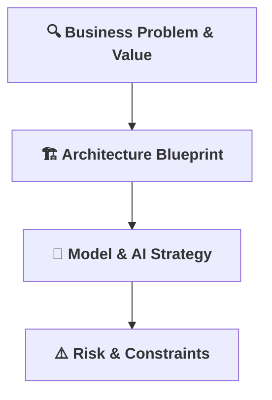

[⬅ Back to Section Overview](README.md)

[⬅ Back to Main Index](../../INDEX.md)

# 🗝️ Key Activities Overview

> **Roadmap for building a world-class AI solution.**  
> Each activity below is a critical pillar in the foundation of the project, no matter the domain.

---

> _Note: Diagram links are not clickable in VS Code Preview or GitHub. Use the list below for navigation._

---

- [🔍 Business Problem & Value](Business_Problem_Value.md): Define the real-world need and value.
- [🏗️ Architecture Blueprint](Architecture_Blueprint.md): Design for scalability and security.
- [🤖 Model & AI Strategy](Model_Strategy.md): Choose the right AI approach.
- [⚠️ Risk & Constraints](Risk_Constraints.md): Identify and address risks early.

---