```mermaid
graph TD
    research["<b>🔬 Model Candidate Research</b>"]
    decision["<b>⚖️ AI Strategy Decision<br>(RAG vs. Fine-tuning vs. Hybrid)</b>"]
    research --> decision
```

[⬅ Back to Section Overview](README.md)

[⬅ Back to Main Index](../../INDEX.md)

# 🤖 Model & AI Strategy

> **Purpose:**  
> Select and justify the AI approach for CodeCraft AI, ensuring up-to-date, context-aware, and high-quality code generation.

---

## 🔍 Model Candidate Research

- **Large Language Models (LLMs):**
  - Evaluate open-source (e.g., Code Llama, StarCoder, WizardCoder) and commercial (e.g., GPT-4, Gemini) models for code generation.
  - Assess models for language coverage, code quality, extensibility, and licensing.

- **Retrieval-Augmented Generation (RAG):**
  - Use embeddings to retrieve relevant code snippets, documentation, and best practices from curated sources (e.g., Stack Overflow, official docs, internal codebases).
  - RAG ensures suggestions are current and tailored to the user’s tech stack.

---

## ⚖️ AI Strategy Decision

- **Chosen Approach:**  
  - **Retrieval-Augmented Generation (RAG) + LLM Synthesis**
    - RAG provides up-to-date, context-rich information.
    - LLM synthesizes code using retrieved context, user prompt, and architectural hints.
    - This hybrid approach balances accuracy, freshness, and flexibility.

- **Rationale:**  
  - RAG mitigates LLM hallucination and outdated knowledge.
  - Enables rapid adaptation to new frameworks, libraries, and coding standards.
  - Supports explainability by surfacing sources for generated code.

---

## 🧮 Model Evaluation Criteria

- **Accuracy:** Code correctness and adherence to best practices.
- **Latency:** Time to generate a response.
- **Explainability:** Ability to trace code suggestions to sources.
- **Cost:** Inference and hosting costs per 1K tokens.
- **Extensibility:** Support for new languages/frameworks.

---

## 🛡️ Fallback & Continuous Improvement

- **Fallback Strategy:**  
  If retrieval fails, gracefully degrade to LLM-only generation with a warning to the user.
- **Continuous Improvement:**  
  Collect user feedback on code quality and relevance; use this data to retrain or fine-tune models and update retrieval sources.

---

---

> **Professional Insight:**  
> RAG is the gold standard for production AI assistants—combining the creativity of LLMs with the reliability of curated, real-world knowledge.