```mermaid
graph TD
    technical["<b>🛠️ Technical Risks</b>"]
    ethical["<b>⚖️ Ethical & Compliance Risks</b>"]
    operational["<b>⏳ Operational Constraints</b>"]
    technical --> ethical
    ethical --> operational
```

[⬅ Back to Section Overview](README.md)

[⬅ Back to Main Index](../../INDEX.md)

# ⚠️ Risk & Constraints

> **Purpose:**  
> Identify technical, ethical, and operational risks early to ensure a smooth project journey for CodeCraft AI.

---

## 🛠️ Technical Risks

- **LLM Hallucination:**  
  Generated code may be incorrect or insecure.  
  *Mitigation:* Integrate code linting, static analysis, and user feedback loop.
- **Latency & Scalability:**  
  High inference times or API bottlenecks under load.  
  *Mitigation:* Optimize model serving, use async APIs, and plan for horizontal scaling.
- **Dependency on External Sources:**  
  Retrieval layer may break if source APIs change.  
  *Mitigation:* Monitor source health, cache critical data, and implement graceful fallbacks.

---

## ⚖️ Ethical & Compliance Risks

- **Copyright & Licensing:**  
  Generated code may inadvertently include copyrighted or GPL-licensed snippets.  
  *Mitigation:* Filter sources, flag license issues, and provide attribution where required.
- **Bias in Suggestions:**  
  LLMs may reflect biases from training data.  
  *Mitigation:* Regularly audit outputs, allow user reporting, and retrain with diverse datasets.
- **Data Privacy:**  
  User prompts or code may contain sensitive information.  
  *Mitigation:* Do not store user data without consent, encrypt all data in transit and at rest.

---

## ⏳ Operational Constraints

- **Compute Costs:**  
  Running large models and retrieval pipelines can be expensive.  
  *Mitigation:* Use model quantization, autoscaling, and monitor usage.
- **Time to Insight:**  
  Users expect near-instant responses.  
  *Mitigation:* Profile system, optimize bottlenecks, and set user expectations.
- **Team Expertise:**  
  Requires expertise in AI, DevOps, and security.  
  *Mitigation:* Document processes, automate where possible, and invest in training.

---

## 🗂️ Risk Severity Matrix

| Risk                       | Likelihood | Impact   | Mitigation Summary                |
|----------------------------|:----------:|:--------:|-----------------------------------|
| LLM Hallucination          | Medium     | High     | Linting, static analysis, feedback|
| Latency/Scalability        | Medium     | Medium   | Async APIs, autoscaling           |
| Copyright/Licensing        | Low        | High     | Source filtering, attribution     |
| Data Privacy               | Medium     | High     | Encryption, no storage by default |
| Bias in Suggestions        | Medium     | Medium   | Audit, user reporting, retraining |
| Compute Costs              | High       | Medium   | Quantization, autoscaling         |

---

## 🏛️ Regulatory Watch

- **Upcoming Regulations:**  
  - Monitor EU AI Act, US AI Bill of Rights, and local data privacy laws for compliance impact.
  - Update documentation and processes as regulations evolve.

---

## 🚨 Incident Response

- **Process:**  
  - Detect and log incidents (security, compliance, model failure).
  - Notify stakeholders within 24 hours.
  - Triage, mitigate, and document root cause.
  - Review and update risk log post-incident.

---

---

> **Professional Insight:**  
> Proactive risk management and clear constraints are hallmarks of senior engineering and leadership.  
> For CodeCraft AI, document and revisit risks regularly as the project evolves.