```mermaid
graph TD
    repo["<b>📖 Polished Repo</b>"]
    narrative["<b>📝 Interview Narrative</b>"]
    repo --> narrative
```

[⬅ Back to Storytelling & Portfolio Overview](README.md)

# 📦 Storytelling & Portfolio Deliverables

> **What you'll walk away with from this step:**

---

- **📖 Polished GitHub Repository:**  
  A showcase-ready, professional project repo for the AI solution.

- **📝 Compelling Interview Narrative:**  
  A story that highlights strengths and achievements.

- **📚 Auto-generated Documentation:**  
  API docs, model cards, and architecture diagrams generated using tools like **Swagger/OpenAPI**, **Sphinx**, or **MkDocs**.

---

---

> **Professional Insight:**  
> These deliverables are the launchpad for new roles, clients, or opportunities. Invest the time to make them shine for every AI project.
