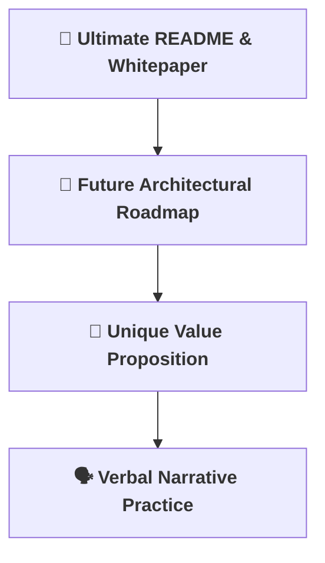

[⬅ Back to Section Overview](README.md)

[⬅ Back to Main Index](../../../INDEX.md#portfolio)

# 🗝️ Key Activities Overview

> **Roadmap for turning technical achievement into career impact.**  
> Each activity below is a step toward a standout portfolio and a compelling personal brand, no matter the AI use case.

---

---

- [📖 Ultimate README & Whitepaper](Ultimate_README.md): Tell the project’s story with clarity and impact.
- [🚀 Future Architectural Roadmap](Future_Roadmap.md): Show the vision for what’s next.
- [💎 Unique Value Proposition](Unique_Value.md): Highlight what sets you apart.
- [🗣️ Verbal Narrative Practice](Verbal_Narrative.md): Prepare for interviews and presentations.

---